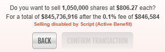
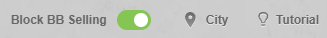

# Disable Stock Benefit Block Selling

A Tampermonkey script for Torn that protects your stock benefit blocks. It prevents you from accidentally selling shares if doing so would cause you to lose an active benefit block or your current dividend progress.

## Features

* **Accident Prevention:** Automatically disables the "Confirm Transaction" button if selling would break a benefit block.
* **Clear Visual Cues:** Grays out the sell button and replaces the standard Torn warning text with a clear script notification.
* **Quick Override:** Includes a simple toggle switch to temporarily disable the protection if you intentionally want to liquidate your shares.

## How It Works

Whenever you open a stock transaction window, the script actively scans for active benefits or pending dividends:

* **Protected State:** If the script detects that a benefit is active, ready, or a dividend is progressing, it locks the "Confirm Transaction" button so it cannot be clicked. The standard warning text is also updated to: *"Selling disabled by Script (Active Benefit)"*.
* **Safe State:** If no benefits are at risk, the script does nothing and you can sell normally.

## Configuration & Override

This script seamlessly integrates a **"Block BB Selling" toggle switch** into the top of the Stocks page and has no configuration settings.

* **To sell a blocked stock:** Simply click the toggle switch to temporarily disable the protection. The "Confirm Transaction" button will immediately unlock, and the original Torn warning texts will be restored.
* **Safety First:** To ensure you are always protected, the toggle switch resets to **enabled (ON)** automatically every time you reload or revisit the Stocks page.

