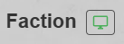
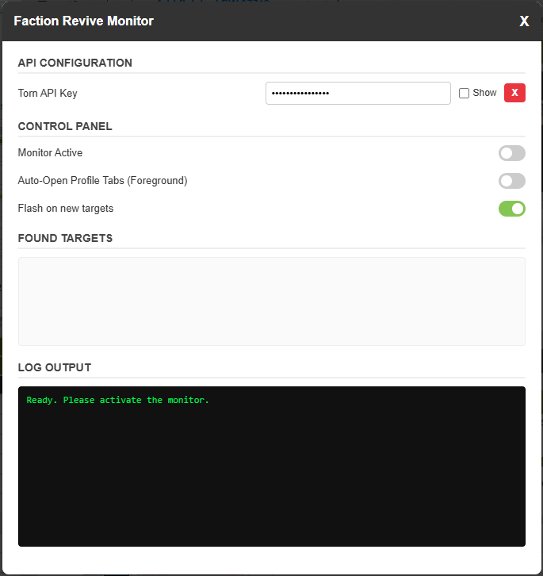
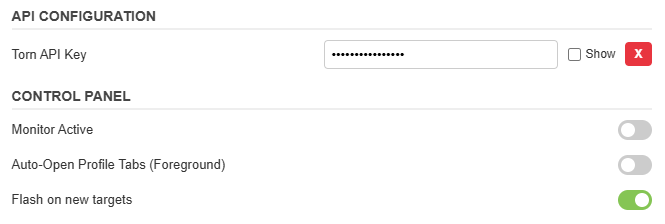
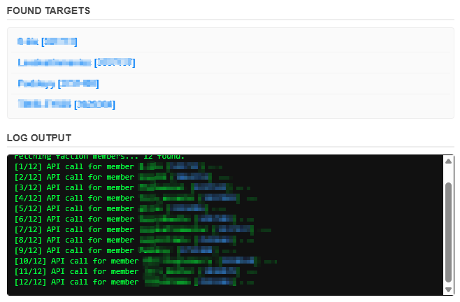

# Faction Revive Monitor (FRM)

A Tampermonkey script for Torn that continuously monitors a specific faction for revivable members. Running directly from a faction's profile page, FRM queries the Torn API to find members who are currently in the hospital and have `revivable = true`. It allows you to automatically open targets in new tabs the moment they become available.

## Installation

[Download from Greasyfork](https://greasyfork.org/de/scripts/567923-faction-revive-monitor)

## Features

* **Automated Target Finding:** Scans the faction list for members who are both in the hospital and currently online, then verifies if they are revivable.
* **Auto-Open Profiles:** Can automatically open found targets in new foreground tabs so you can revive them instantly. *Note: Every found target will open a new tab. This means multiple tabs can open simultaneously.*
* **Flash Alerts:** Triggers a visual flash animation in the results box when a new target is found, ensuring you don't miss an opportunity.
* **Optimized API Usage:** Runs on a fixed 30-second interval. This matches the Torn API's cache limit, ensuring you get updates without wasting API calls.
* **API Key Storage:** Your Torn API key is stored strictly locally in your browser and is never shared or transmitted anywhere else.

## How It Works

Once installed, the script adds a small monitor icon next to the faction's name on their profile page. 

1. **Launch the Monitor:** Click the monitor icon to open the FRM control panel.
2. **Enter API Key:** Enter your public Torn API key.
3. **Start Monitoring:** Toggle the "Monitor Active" switch to ON.
4. **The Loop:** The script will fetch the faction members list, filter for those in the hospital and online, and then individually check their profiles to confirm they are revivable. It repeats this process every 30 seconds.

*Note: If you close the modal while the monitor is running, it will automatically stop.*

## Configuration

The FRM Control Panel contains all the settings you need to customize your monitoring experience.

### Settings Breakdown

* **Torn API Key:** Enter your API key here. You can toggle the visibility to check it or completely remove it using the "X" button.
* **Monitor Active:** Starts or stops the 30-second checking loop. A countdown timer will appear next to it to show you when the next data fetch happens.
* **Auto-Open Profile Tabs:** When enabled, any newly found revivable target will immediately open in a new tab, forcing the browser to switch focus to it. *Note: Since EVERY found target opens its own tab, multiple tabs may open at once.*
* **Flash on new targets:** Toggles the visual flashing effect in the results box when a revivable player is found.

### Logs & Results
The bottom half of the modal features a **Found Targets** box containing direct links to the profiles of revivable members, and a live **Log Output** console that shows you what the script is doing, including API calls and errors.

