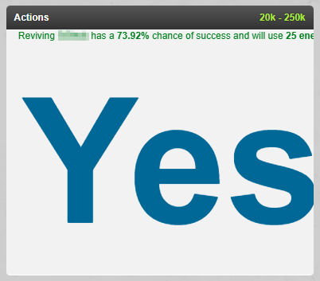
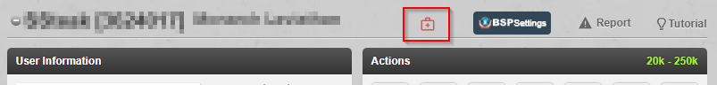
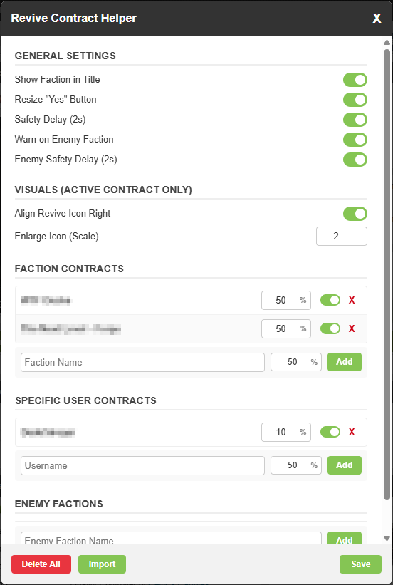

# Revive Contract Helper (RCH)

A Tampermonkey script for Torn designed for revivers. RCH helps you manage revive contracts, prevents accidental revives below the contracted percentage or on enemy targets, and optimizes the UI for faster, misclick-free reviving.

## Installation

[Download from GreasyFork](https://greasyfork.org/de/scripts/565999-revive-contract-helper)

## Features

* **Smart Revive Protection:** Automatically hides the "Yes" button if the target's revive chance is below their contract limit or if early discharge is available.
* **Enemy Detection:** Get warned before accidentally reviving members of an enemy faction with an optional safety delay to prevent fast-clicking mistakes.
* **Granular Contracts:** Set specific minimum chances for entire Factions or individual Users (User contracts override Faction contracts). Track Enemy Factions to avoid reviving them.
* **Speed-Optimized UI:** Optionally enlarge the Revive icon on profiles and the "Yes" confirmation button to make speed-clicking easier.
* **Discord Import:** Mass-import weekly contracts directly from Discord announcements. The parser automatically detects both contracted factions and enemy factions.

## How It Works

Once you add contracts or enemies in the settings, the script monitors the revive confirmation popup:

* **Valid Revive (Chance >= Contract):** The "No" button is hidden. The "Yes" button is enlarged (if enabled) so you can click blindly without missing.
* **Invalid Revive (Chance < Contract):** The confirmation buttons are hidden and a warning is displayed.
* **Enemy Detected:** If the target belongs to a faction on your Enemies list, a big "ENEMY FACTION DETECTED!" warning is displayed.

### Enlarged Profile Revive Icon
You can choose to scale up the revive action icon directly on a player's profile and snap it to the right side. This visual boost only triggers if the player is part of an active contract, helping you spot and click valid targets instantly.


### Giant "Yes" Confirmation Button
To speed up your reviving process, the script can resize the "Yes" confirmation to take up a massive portion of the screen. This allows you to click rapidly without needing to aim precisely.



### The Override Button
If you hit a target below their contract (or an enemy) but want to revive them anyway, you can click the **Override Warning** button. By default, this button has a **2-second safety delay** to prevent accidental double-clicks during fast reviving.

 

## Configuration

To open the RCH settings, click the **red medical bag icon** in the top of any profile page.


### General Settings


* **Show Faction in Title:** Copies the target's faction name directly under their username in the profile header. Click the text to quickly copy it.
* **Resize "Yes" Confirmation Button:** Makes the "Yes" button huge when the revive is valid.
* **Enable Safety Delay (2s):** Adds a 2-second cooldown to the Override button to prevent accidental misclicks on contracted targets.
* **Warn on Enemy Faction:** Displays a prominent warning if you try to revive someone from a faction on your Enemy list.
* **Enemy Safety Delay (2s):** Adds an override button with a 2-second cooldown specifically when an enemy is detected.
* **Align Profile Revive Icon Right:** Moves the revive action icon on the profile page to the far right of the button list. *(Note: Only applies if the target has an active contract).*
* **Enlarge Profile Revive Icon (Scale Factor):** Increases the size of the revive icon on the profile. Default is `1` (off). Set to `3` or `4` to make it massive. *(Note: Only applies if the target has an active contract).*

### Managing Contracts & Enemies

You can add contracts for **Factions**, specific **Users**, or **Enemy Factions**.
1. Enter the Faction Name or Username. (*Note: it's the name, not the ID!*)
2. For Factions and Users, enter the contracted chance. (Enemies do not require a percentage).
3. Click **Add**.
4. Click the **Save** button to apply and save your changes.

*Logic Note: If a player is in a contracted faction (e.g., 50%) but has a specific user contract (e.g., 30%), the script will use the 30% limit.*

## Mass Import from Discord

Instead of adding factions one by one, you can import them directly from your Discord announcements, provided the format of the announcement matches the supported structure (see below).

**Note:** The import process does **not** delete your existing contracts. It only adds new ones. If you want to start with a fresh list for the new week, please click the **Delete All** button before importing.

1. Click the **Import** button in the bottom left of the settings menu.
2. Paste the entire contract message into the text area.
3. Click **Process Import**.
4. **Important:** Click the **Save** button in the main settings menu to actually apply and save your newly imported contracts!

  

**Supported Formats Details:**
The smart parser reads the text line by line and pairs a **Target Name** with a **Percentage**. It can also automatically detect enemy factions. The parser looks for two components in order:

* **Step 1: The Name & Enemy**
    * *Option A (Markdown):* Start the line with `## [` followed by the name. 
        *Example:* `## [Target Faction](https://www.torn.com/...)`
    * *Option B (Plain Text with Enemy):* Put the exact string ` vs ` between the target and the enemy. The script will automatically add the first to your Faction list and the second to your Enemy list!
        *Example:* `Target Faction vs Enemy Faction`
* **Step 2: The Percentage**
    * On a line *following* the name, the script looks for the word `Conditions:` (Markdown bolding like `**Conditions**:` is fully supported).
    * On that same line, it requires the exact pattern `.. XX%++` (where XX is the minimum required chance).

**Minimal Custom Example:**
If you want to manually type up a quick import list, it just needs to look like this:

```text
Target Faction vs Enemy Faction
Conditions: anything here .. 50%++